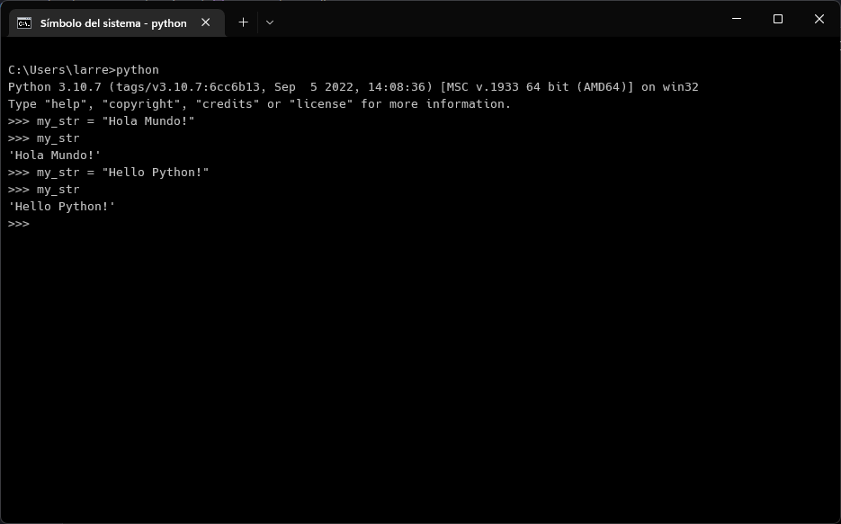

# Enunciado del ejercicio

## Enunciado 1

**Desde la consola de python almacena la cadena “Hola mundo!” en una variable y muéstrala.**

SOLUCIÓN

 
 

## Enunciado 2

**Modifica la variable del anterior ejercicio en la consola de python y después muestrala por consola para ver la modificación de la variable.**

SOLUCIÓN

